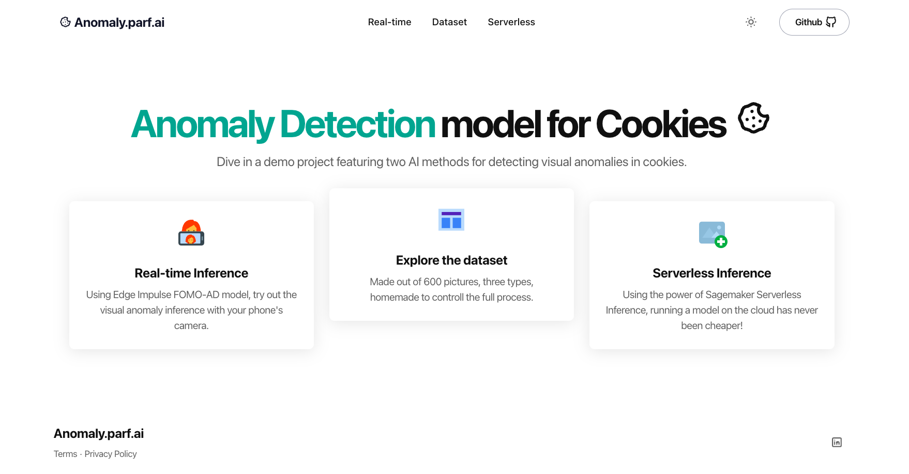

# Anomaly.parf.ai

## INTRODUCTION

This project is a full demo featuring Anomaly Detection models on cookies from developing the notebooks to the web app deployment.

- **PROD**: https://anomaly.parf.ai/
- **DEV**: https://dev.anomaly.parf.ai/

**MAIN FEATURES**

- Three models (Baseline, EfficientAD, FOMO AD)
- A web app
    - Efficient AD model using Sagemaker serverless endpoint
    - FOMO AD model using your browser as real-time inference from Edge Impulse
- An API for the serverless inference endpoint
- Automatic deployment with AWS using Terraform

## FOLDER STRUCTURE

- [`.github`](.github/) code related to the [deployment](#website-deployment) of the website after a git push
- [`ai`](ai/) Code related to the model's development
- [`api`](api/) Code the inference API
- [`infrastructure`](infrastructure/) Code related the automated infrastructure
- [`website`](website/) Code related to the web app

### WEBSITE DEPLOYMENT

- Deploy the website after a git push **IF** the commit message contains the text: "deploy:website" within the commit message

    - branch dev to deploy to dev.anomaly.parf.ai
    - branch prod to deploy to anomaly.parf.ai